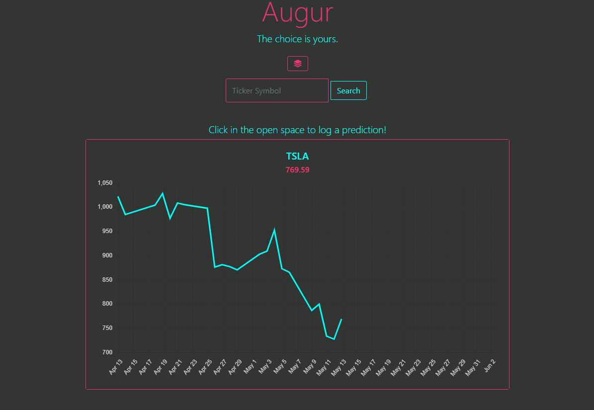
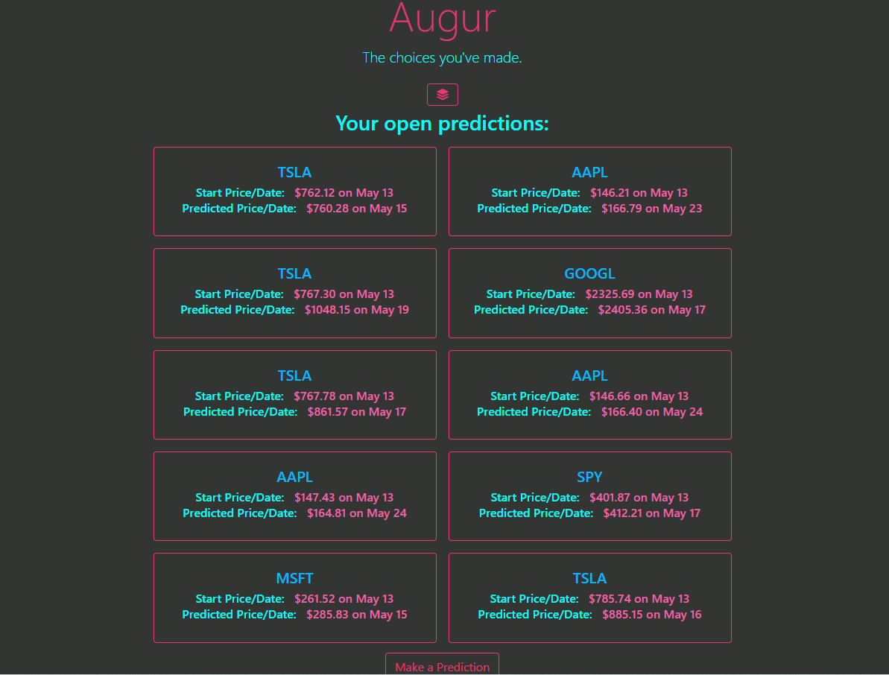

# augur

Augur is a full stack web application that allows users to log and store stock market predictions.  The purpose of this application is to connect with users who enjoy stocks and gaming.  

The user will be able to create an account, then they can search for a stock to make a prediction on.  They can see the stock's recent activity, and can make a specific prediction on the chart itself.  Finally on their portfolios, the user can see their last few predictions.

## Technologies Used
### APIs
Polygon API

Polygon API provides data on stocks.  

### JavaScript Tech
Chart.JS

Chart.JS is used to display the stock data to the user.

## Screenshots
### Home Page

### Prediction Page

### Portfolio Page

## Deployed Heroku Application
https://augur-app.herokuapp.com/ 

## Link to Repository
https://github.com/sammymayhem/the-coin-flips 